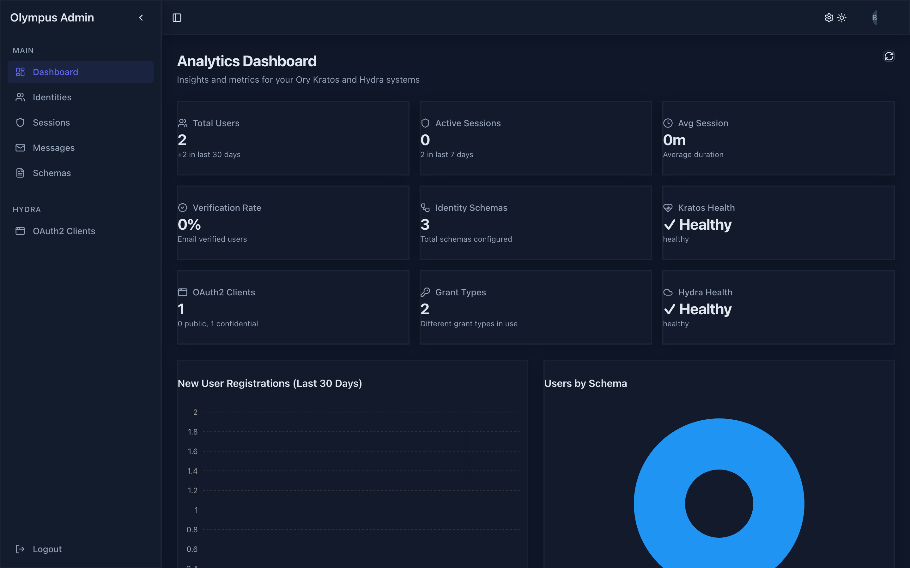
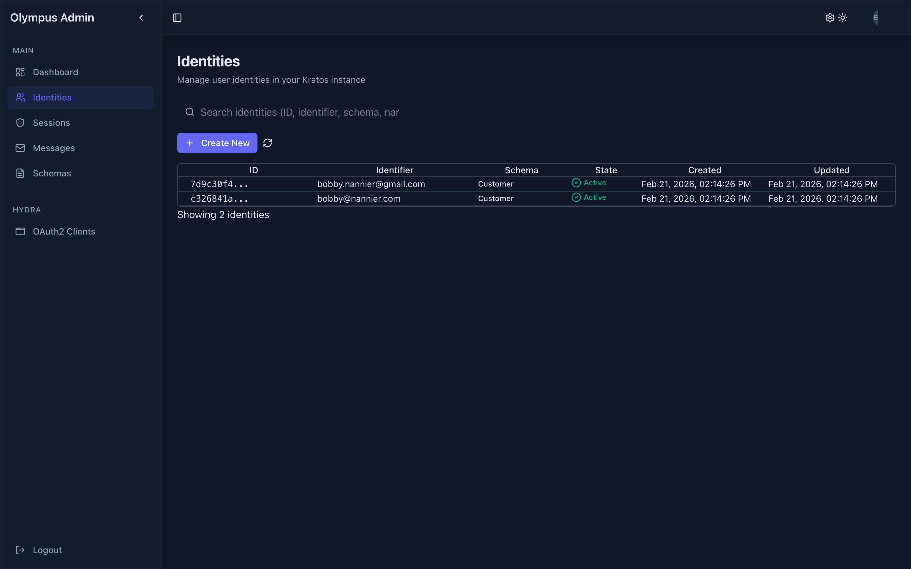
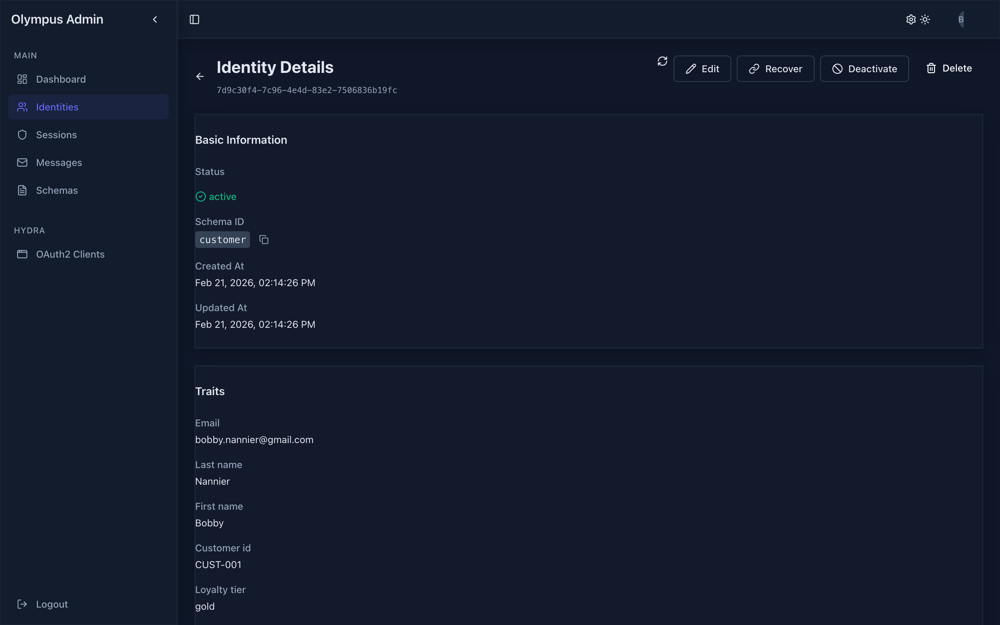
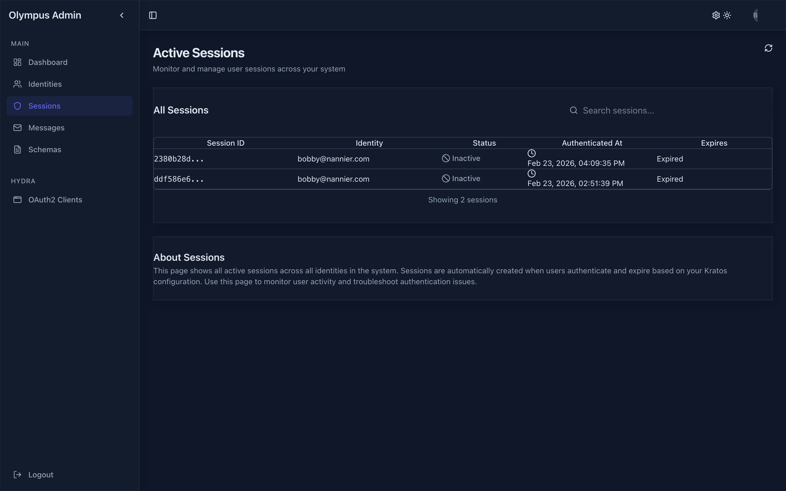
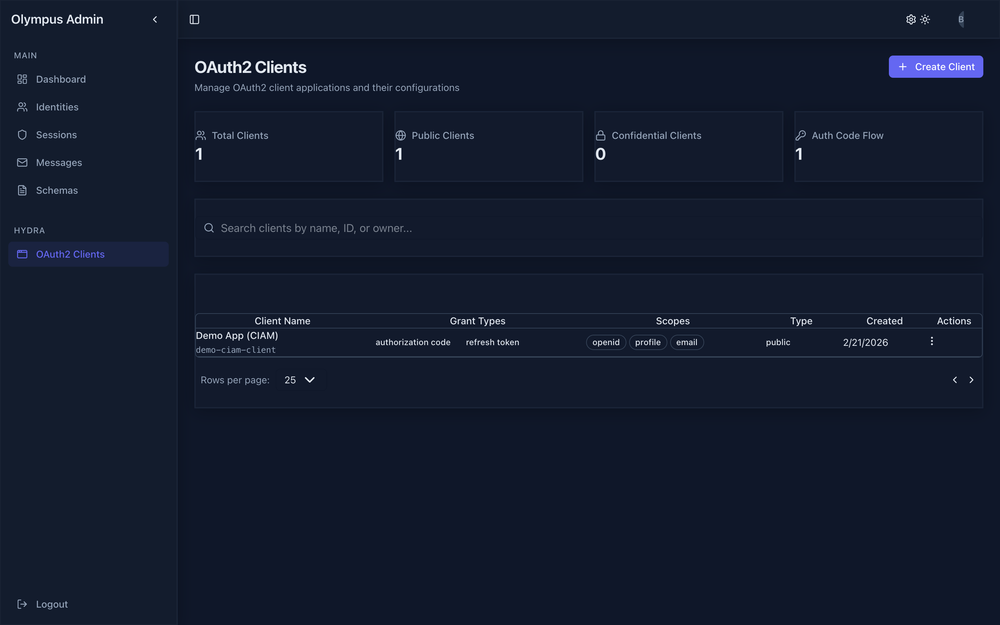
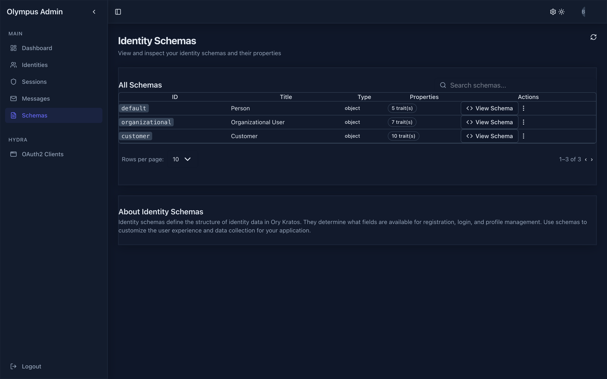
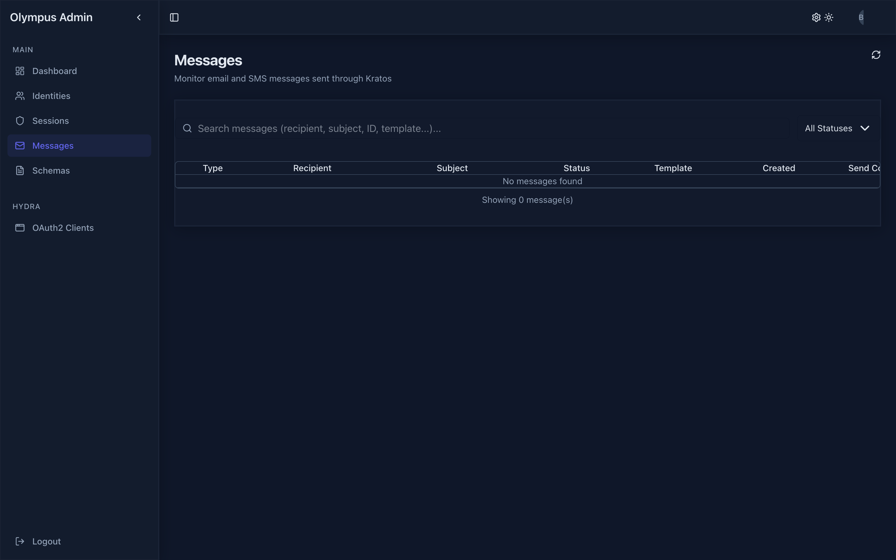
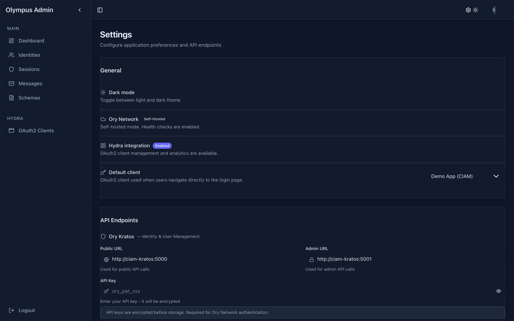

# Athena

Admin panel for [Ory Kratos](https://www.ory.sh/kratos/) identity management and [Ory Hydra](https://www.ory.sh/hydra/) OAuth2 server.

Built with Next.js, TypeScript, and the [Canvas](https://github.com/OlympusOSS/canvas) design system.

---

## Screenshots

| Dashboard | Identities |
|-----------|------------|
|  |  |

| Identity Details | Sessions |
|-----------------|----------|
|  |  |

| OAuth2 Clients | Schemas |
|---------------|---------|
|  |  |

| Messages | Settings |
|----------|----------|
|  |  |

---

## Features

### Kratos Identity Management

- **Dashboard** — User growth, active sessions, verification rates, schema distribution, and service health
- **Identities** — Create, view, edit, and delete identities with schema-driven forms. Search, bulk operations, account recovery
- **Sessions** — Monitor active sessions, revoke individually or in bulk
- **Messages** — Track courier messages (email/SMS) with delivery status
- **Schemas** — View and inspect identity schemas with JSON visualization

### Hydra OAuth2 Management

- **OAuth2 Clients** — Full CRUD for OAuth2/OIDC clients — grant types, scopes, redirect URIs, token lifetimes
- **OAuth2 Tokens** — View and revoke access/refresh tokens

### General

- Light and dark theme
- Runtime endpoint configuration (connect to any Kratos/Hydra instance)
- Compatible with [Ory Network](https://www.ory.sh/network/) (managed) and self-hosted Ory

---

## Prerequisites

- An [Ory Kratos](https://www.ory.sh/kratos/) instance (required)
- An [Ory Hydra](https://www.ory.sh/hydra/) instance (optional — enables OAuth2 client and token management)

---

## Environment Variables

| Variable | Description | Default |
|----------|-------------|---------|
| `KRATOS_PUBLIC_URL` | Kratos public API | `http://localhost:3100` |
| `KRATOS_ADMIN_URL` | Kratos admin API | `http://localhost:3101` |
| `KRATOS_API_KEY` | Kratos API key (if required) | — |
| `HYDRA_PUBLIC_URL` | Hydra public API | `http://localhost:3102` |
| `HYDRA_ADMIN_URL` | Hydra admin API | `http://localhost:3103` |
| `HYDRA_API_KEY` | Hydra API key (if required) | — |
| `HYDRA_ENABLED` | Enable Hydra integration | `true` |
| `IS_ORY_NETWORK` | Ory Network mode (disables health checks) | `false` |
| `BASE_PATH` | Base path prefix | — |

Endpoints and API keys can also be configured at runtime via the **Settings** page.

---

## Getting Started

Athena is part of the [OlympusOSS Identity Platform](https://github.com/OlympusOSS/platform). All repos must be cloned as siblings under a shared workspace:

```
Olympus/
├── platform/    # Infrastructure & Docker Compose — start here
├── athena/      # Admin dashboard (this repo)
├── hera/        # Auth & consent UI
├── site/        # Brochure site & OAuth2 playground
├── canvas/      # Design system
└── octl/        # Deployment CLI
```

### Start the development environment

```bash
cd platform/dev
docker compose up -d
```

Wait for the seed to complete, then open:

- **IAM Athena** — [http://localhost:4003](http://localhost:4003) (employee admin)
- **CIAM Athena** — [http://localhost:3003](http://localhost:3003) (customer admin)

Athena is volume-mounted into Docker for **live reload** — edit files locally and changes reflect immediately.

### Standalone (without platform)

```bash
bun install
bun run dev
```

Open [http://localhost:3000](http://localhost:3000). Requires Kratos (and optionally Hydra) running separately.

### Commands

```bash
bun run dev          # Start development server
bun run build        # Build for production
bun run start        # Start production server
bun run lint         # Run Biome linter
bun run lint:fix     # Auto-fix lint issues
```

---

## Tech Stack

| Category | Technology |
|----------|-----------|
| Framework | Next.js 16, React 19 |
| Language | TypeScript |
| Runtime | [Bun](https://bun.sh/) |
| Design System | [@olympusoss/canvas](https://github.com/OlympusOSS/canvas) |
| Styling | Tailwind CSS |
| Charts | Nivo |
| State | Zustand |
| Data Fetching | TanStack Query |
| Forms | React JSON Schema Form (RJSF), React Hook Form |
| API Clients | @ory/kratos-client, @ory/hydra-client |
| Icons | Lucide React |
| Linting | Biome |

---

## Project Structure

```
src/
├── app/                    # Next.js App Router
│   ├── (app)/              # Protected routes
│   │   ├── dashboard/      # Analytics dashboard
│   │   ├── identities/     # Identity list, create, detail
│   │   ├── sessions/       # Session management
│   │   ├── messages/       # Courier message tracking
│   │   ├── schemas/        # Identity schema viewer
│   │   ├── clients/        # OAuth2 client CRUD
│   │   ├── tokens/         # OAuth2 token management
│   │   ├── settings/       # Endpoint configuration
│   │   └── profile/        # User profile
│   ├── (auth)/             # Login page
│   └── api/                # API routes (auth, config, health)
├── components/             # Shared layout and form components
├── features/               # Feature modules
│   ├── analytics/          # Dashboard data hooks
│   ├── auth/               # Authentication store and guards
│   ├── identities/         # Identity hooks, table, forms, dialogs
│   ├── sessions/           # Session hooks and components
│   ├── messages/           # Message hooks and components
│   ├── schemas/            # Schema hooks and viewer
│   ├── oauth2-clients/     # OAuth2 client hooks and form
│   ├── oauth2-tokens/      # Token hooks
│   └── settings/           # Settings store
├── services/               # API service layer
│   ├── kratos/             # Kratos API client and endpoints
│   └── hydra/              # Hydra API client and endpoints
├── hooks/                  # Shared hooks (pagination, search, debounce, formatters)
├── lib/                    # Utilities (HTTP client, crypto, date helpers)
└── providers/              # React context (Query, Theme, Auth)
```

---

## License

MIT
